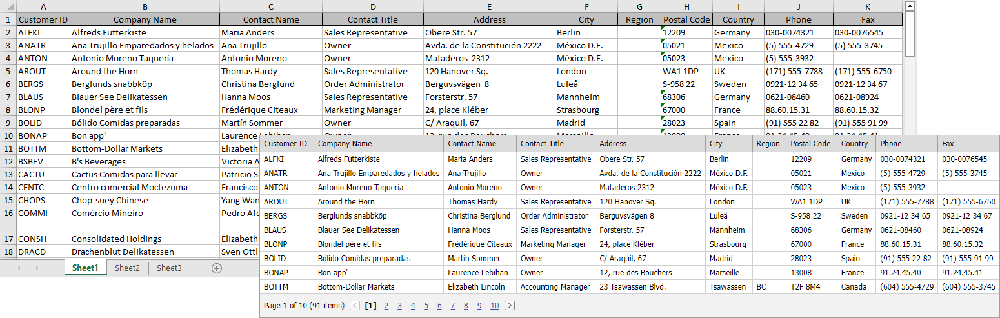

<!-- default badges list -->

<!-- default badges end -->

# Grid View for ASP.NET MVC - How to bind grid to an Excel file
<!-- run online -->
**[[Run Online]](https://codecentral.devexpress.com/e4458/)**
<!-- run online end -->

The DevExpress MVC GridView Extension does not work directly with real storage (like databases, MS office files, etc.). Load an Excel file into a standard ADO.NET DataTable object and use it as a GridView Model.

## Files to Review

* [HomeController.cs](./CS/CS/Controllers/HomeController.cs) (VB: [HomeController.vb](./VB/CS/Controllers/HomeController.vb))
* [Model.cs](./CS/CS/Models/Model.cs) (VB: [Model.vb](./VB/CS/Models/Model.vb))
* [DataTableDataBindingPartial.cshtml](./CS/CS/Views/Home/DataTableDataBindingPartial.cshtml)

## More Examples

* [Grid View for ASP.NET Web Forms - How to bind grid to an Excel file](https://github.com/DevExpress-Examples/how-to-bind-aspxgridview-with-excel-file-e4457)
